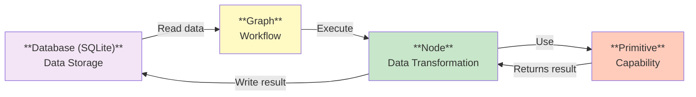

# Agent-Native Clay for Claude Code


## Why Build This?

### Experiment how to build Claude Code Native Softwares

Most CC usage fall into one of category:

1. **Simple Chat bot + Files**: Mostly around personal OS. get some simple emails , read articles etc and summarize to another markdown. Mostly use only CC's native primitives -> lack ability to execute and do real, complicated work 
2. **Claude Code as Coding Agent**: Use Claude Code to build complicated softwares but the softwares involves nothing from Claude Code. 

**What we want to experiment**: Build Task-specific softwares(tools) to let Claude Code do things at scale. Plugin is what we feel the closest but for now we are building as Repo to iterate. We use Clay-like functions to experiment the required abstraction to build agent-native software

**Build enrichment tables through conversation with Claude.**

This is an agent-native alternative to Clay: an enrichment system where **prompts become features (table columns)**, powered by composable integrations that Claude discovers, combines, and evolves through natural language.

No GUI clicking. No YAML editing. No command memorization.

Just describe what you want enriched, and Claude figures out how.

---

## The Vision: Context Aware Lead List Building

**Traditional enrichment tools (Clay):**
```
User → GUI → Click → Configure → Run
Agent → ❌ Can't reuse your existing contexts
Agent → ❌ Can't read workflows
Agent → ❌ Can't modify tables
Agent → ❌ Can't inspect results programmatically
```

**This system solves parity:**
- ✅ All the context are available to Claude Code
- ✅ What you can do, Claude can do
- ✅ What Claude does, you can inspect and edit
- ✅ Results are durable (SQLite, not in-memory)


**Agent-native enrichment (this system):**
```
User: "Get LinkedIn headline and follower count"
Claude: [discovers linkedin_profile integration]
        [generates workflow: YAML + nodes]
        [creates `headline` and `follower_count` columns]
        [executes enrichment]

User: "Now add posts mentioning AI agents"
Claude: [composes linkedin_posts + filter_by_keywords]
        [extends workflow]
        [adds `ai_agent_mentions` column]
```

**Key difference:** Everything is code (YAML + Python). Claude reads, executes, and iteratively improves through conversation.

---


### Design Philosophy

**Minimize runtime coding + Minimize prebuilt tools = Maximum composability**

Instead of:
- Writing custom code for every enrichment request
- Maintaining hundreds of prebuilt integrations

Claude:
1. **Explores** available primitive integrations (DataGen MCP tools)
2. **Composes** them into workflows (YAML graphs + Python nodes)
3. **Learns** what's possible and reuses knowledge across conversations

---

## The 5-Component System

### 1. Database (SQLite)
- **Not CSV**: Writes are immediate and durable
- **Enables**: Massive parallelization, row-level status tracking
- **Git-ignored**: Keeps repo clean

### 2. Graph (YAML)
- **Human-auditable**: Simple YAML workflow definitions
- **Agent-modifiable**: Claude can diff and update
- **Version-controlled**: Track workflow evolution

### 3. Nodes (Python)
- **Last-mile logic**: Task-specific transforms
- **Generated**: Claude writes based on primitives
- **Example**: "Count VP Sales commenters" = fetch commenters → filter by title → count

### 4. Primitives (Integrations)
- **Building blocks**: DataGen MCP tool wrappers
- **Capability exploration**: Claude discovers what's possible
- **Composable**: Mix and match to create features

### 5. Batch Execution Engine
- **Parallelized**: Process multiple rows concurrently
- **Resumable**: Skip completed rows, retry failures
- **Progress tracking**: Real-time status updates
- **Durable**: Every write persisted to SQLite immediately

**Flow:**
```
Database → Batch Engine reads → Graph executes → Nodes transform → Primitives fetch → Results write back → Database
```

---

## Quick Start

### Prerequisites

1. **Get Claude Code:** https://claude.com/code
2. **Install DataGen CLI:** [datagen-cli](https://github.com/datagendev/datagen-cli)
   ```bash
   curl -fsSL https://cli.datagen.dev/install.sh | sh
   ```
3. **Configure DataGen MCP:**
   ```bash
   datagen login    # Set your DATAGEN_API_KEY
   datagen mcp      # Add DataGen MCP to Claude Code
   ```

### Usage

1. **Import CSV to `lead-list/`:**
   ```bash
   cp your-leads.csv lead-list/my-prospects.csv
   ```
2. **Run `/enrichment`** - Claude asks what to enrich, discovers integrations, previews, then runs
3. **Run `/view-table`** - View enriched data in interactive table
4. **Run `/send-to-clay`** - Push to Clay (optional)
5. **Run `/build-integrations`** - If no matching integration exists (optional)

---

## Skills (Slash Commands)

Use these in Claude Code for common workflows:

### `/enrichment` - Interactive Enrichment Workflow

The main enrichment skill. Claude will:
1. Ask what you want to enrich
2. Discover matching integrations
3. Preview first N rows (you choose)
4. Launch table viewer for review
5. Ask for confirmation before full run

**Example conversation:**
```
You: /enrichment

Claude: Which lead list do you want to enrich?
- campaign-analysis (SQLite)
- example-leads (SQLite)

You: campaign-analysis

Claude: What do you want to enrich these leads with?

You: Get reply rates and engagement metrics from HeyReach

Claude: [discovers heyreach_campaign_stats integration]
        [creates workflow]
        [previews 5 rows]
        [launches table viewer]

        Preview complete. Proceed with full enrichment?
```

### Other Skills

- **`/view-table`** - Launch interactive table viewer (shows both SQLite and CSV files)
- **`/build-integrations`** - Build new DataGen integrations
- **`/send-to-clay`** - Send enriched leads to Clay
- **`/heyreach-campaign-report`** - Generate HeyReach campaign performance reports
- **`/linkedin-engagement`** - Track LinkedIn post engagement

See `.claude/skills/` for all available skills.

---

## What You Can Ask Claude

Claude can discover and compose integrations for:

**LinkedIn enrichment:**
- "Get their LinkedIn headline and follower count"
- "Find posts mentioning 'AI agents'"
- "Check their posting frequency"

**Company research:**
- "Research company funding stage"
- "Find the CEO's LinkedIn profile"
- "Get company employee count"

**Engagement tracking:**
- "Get HeyReach campaign reply rates"
- "Check if they've engaged with our posts"
- "Find mutual connections"

**Custom combinations:**
- "Get LinkedIn profile data AND find posts about Claude"
- "Enrich with company data, then find the CEO"
- "Track campaign performance across all leads"

Claude will:
1. Search available integrations
2. Compose them into a workflow
3. Show you preview results
4. Ask for confirmation before running

---

## View Your Data

### Table Viewer (Recommended)

Run `/view-table` in Claude Code to launch the interactive table viewer.

**Features:**
- Browse all lead lists in one place (SQLite + CSV)
- Sort, filter, search
- View enrichment workflow analysis
- Check success/failure rates

### Terminal (Quick Check)

```bash
# Show first 5 rows
sqlite3 -header -column leads/my-prospects/table.db "SELECT * FROM leads LIMIT 5"

# Check status
sqlite3 leads/my-prospects/table.db "SELECT _status, COUNT(*) FROM leads GROUP BY _status"
```

---

## How It Works

### 1. Integrations = Composable Building Blocks

Each integration is a DataGen MCP tool wrapper:

```python
# scripts/integrations/linkedin_profile.py
class LinkedInProfile(Integration):
    input_cols = ["linkedin_url"]
    output_cols = ["headline", "current_company", "location", "follower_count"]

    def _enrich(self, row: dict) -> tuple[dict, str]:
        # Calls DataGen MCP tool
        result = self.client.execute_tool(...)
        return result, ""
```

**Available integrations:**
- `linkedin_profile` - Profile data
- `web_research` - Company info via web search
- `find_ceo` - CEO from company domain
- `heyreach_campaign_stats` - Campaign metrics
- `linkedin_post_activity` - Post frequency
- `linkedin_claude_mentions` - Posts about Claude

Claude discovers these automatically with `ls scripts/integrations/` or `searchTools`.

### 2. Workflows = YAML Graph

Claude creates workflow definitions:

```yaml
# leads/my-prospects/graph/graph.yaml
workflows:
  profile_enrichment:
    nodes:
      - profile_enrichment
      - keyword_mentions
```

### 3. Nodes = Custom Python Logic

When needed, Claude writes nodes for custom transforms:

```python
# leads/my-prospects/graph/nodes/keyword_mentions.py
class KeywordMentions(Graph):
    def run(self, row: dict) -> tuple[dict, str]:
        # Compose multiple primitives
        posts = fetch_linkedin_posts(row["linkedin_url"])
        filtered = filter_by_keywords(posts, ["AI", "agents"])
        return {"mentions_count": len(filtered)}, ""
```

### 4. SQLite = Durable Storage

Every row tracks status in SQLite:
- `pending` → not yet processed
- `completed` → enrichment succeeded
- `failed` → enrichment failed (with error message)

**Benefits:**
- Resume after interruption
- Retry failed rows
- Query status anytime
- No git bloat from large CSVs

---

## How Enrichment Works

### From Prompt to Column

Each enrichment request becomes a table column through composition:

**Example 1: Simple integration**
```
"Get LinkedIn headline"
→ Uses linkedin_profile primitive
→ Creates `headline` column
```

**Example 2: Composed integrations**
```
"Count posts about AI agents"
→ Composes linkedin_posts + filter_by_keywords primitives
→ Creates `ai_agent_mentions` column
```

**Example 3: Custom node logic**
```
"Count VP Sales commenters"
→ Claude generates node: fetch commenters → filter by title → count
→ Creates `vp_sales_commenter_count` column
```

### Iterative Workflow

**Start simple, add complexity as needed:**

```
Session 1:
User: "Get LinkedIn profiles"
Claude: [uses linkedin_profile integration]
        [creates headline, company, location columns]

Session 2:
User: "Now check if they've posted about Claude"
Claude: [extends workflow with linkedin_post_activity]
        [adds claude_mentions column]

Session 3:
User: "Only show people who posted in the last 30 days"
Claude: [generates filter node]
        [adds recent_activity boolean]
```

Everything is preserved in YAML + Python. Claude picks up where you left off.

---

## Architecture

### System Schematic



**Components:**
- **Database (SQLite)**: Data storage with row-by-row status tracking
- **Graph**: Workflow definition (YAML)
- **Node**: Data transformation logic (Python)
- **Primitive**: Capability (DataGen MCP tool wrapper)

### Directory Structure

```
leads/
├── my-prospects/           # Lead list directory
│   ├── table.csv          # Source data (git-tracked)
│   ├── table.db           # SQLite database (git-ignored)
│   └── graph/
│       ├── graph.yaml     # Workflow definition
│       └── nodes/         # Custom node code
│           └── my_node.py

scripts/
├── graph_enrich.py        # Batch executor
├── integrations/          # DataGen MCP tool wrappers
│   ├── linkedin_profile.py
│   └── ...
└── viewer/                # Web table viewer
    └── server.ts
```

**Key files Claude reads/writes:**
- `leads/{name}/table.csv` - Source data
- `leads/{name}/graph/graph.yaml` - Workflow definition
- `leads/{name}/graph/nodes/*.py` - Custom node code
- `leads/{name}/table.db` - Enriched results

---

## Manual Commands (If Needed)

While skills handle most workflows, you can run commands directly:

```bash
# List workflows
python3 scripts/graph_enrich.py --lead my-prospects --list

# Preview enrichment
python3 scripts/graph_enrich.py --lead my-prospects --workflow basic --preview --limit 5

# Run full enrichment
python3 scripts/graph_enrich.py --lead my-prospects --workflow basic

# Export to CSV
sqlite3 -header -csv leads/my-prospects/table.db "SELECT * FROM leads" > export.csv
```

See `.claude/skills/enrichment/reference/commands.md` for full reference.

---

## Adding New Integrations

Run `/build-integrations` in Claude Code to create new integrations.

Claude will:
1. Ask what integration you need
2. Search for matching DataGen MCP tools
3. Generate the integration code
4. Register it automatically
5. Make it available for enrichment workflows

---

## Issue Tracking (Beads)

This project uses **bd** (beads) for persistent issue tracking:

```bash
# Find ready tasks
bd ready

# Show issue
bd show <id>

# Update status
bd update <id> --status=in_progress
```

See `.beads/` directory for tracked issues.

---

## Why This Approach?

**Traditional enrichment tools:**
- GUI-only configuration (agents can't read/edit)
- Opaque execution (can't inspect workflow)
- No version control (changes aren't tracked)

**Agent-native enrichment:**
- Everything is code (YAML + Python)
- Claude reads/writes directly
- Git-trackable workflows
- Durable SQLite storage
- Composable integrations

The goal: Make enrichment something Claude can **read, execute, and improve** through conversation.

Full design notes: `why-i-build-this.md`

---

## License

MIT
