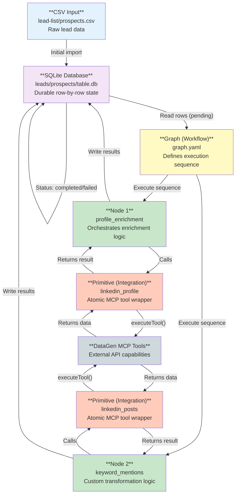

# Agent-Native Enrichment Architecture

## System Schematic



## Component Relationships

### 1. **CSV Input** → **SQLite Database**
- Initial import creates SQLite table with `_status` column
- Each row tracks: `pending` → `in_progress` → `completed`/`failed`
- Durable storage enables resumable workflows

### 2. **Graph (Workflow)** → **Nodes**
- YAML defines execution sequence
- Each workflow lists nodes to run in order
- Claude reads/writes this to compose enrichment pipelines

### 3. **Nodes** → **Primitives (Integrations)**
- Nodes orchestrate enrichment logic
- Call one or more primitives (atomic integrations)
- Transform and combine primitive outputs
- Return results to be written to SQLite

### 4. **Primitives (Integrations)** → **MCP Tools**
- Atomic wrappers around DataGen MCP tools
- Explicit input/output contract (columns defined)
- Error-first return: `(result, error)`
- Composable building blocks

### 5. **SQLite Database** (Central State)
- Stores all enriched data
- Tracks per-row status and errors
- Source of truth for workflow progress
- Enables incremental enrichment

## Data Flow Example

```
1. User imports CSV → SQLite (all rows: pending)
2. Graph executor reads pending rows
3. For each row:
   - Graph.yaml: run profile_enrichment node
   - Node calls linkedin_profile primitive
   - Primitive calls mcp_LinkedIn_get_profile
   - MCP returns data
   - Primitive returns (result, "")
   - Node writes to SQLite (status: completed)
4. Repeat for next node in workflow
```

## Key Properties

**Parity**: Everything is file-based (CSV, YAML, Python, SQLite)
- Claude can read, write, execute all components
- No hidden GUI-only state

**Composability**: Primitives are atomic
- Nodes combine primitives in flexible ways
- New enrichment = new combination, not new primitive

**Durability**: SQLite tracks per-row state
- Resume after failures
- Retry failed rows
- Incremental enrichment

**Auditability**: All logic is in version control
- Graph (YAML), Nodes (Python), Primitives (Python)
- Git-trackable changes
- Diff-friendly workflow evolution
